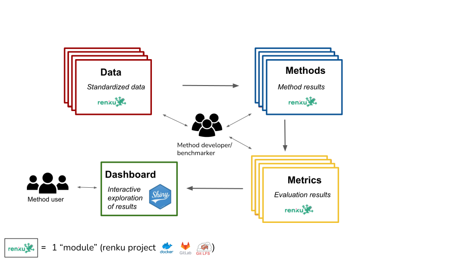

# Omnibenchmark

Generate and manage omnibenchmark modules for open and continous benchmarking.
Each module represents a single building block of a benchmark, e.g., dataset, method, metric, ...
Omnibenchmark-py provides a structure to generate modules and automatically run them.



## Installation

You can install **omnibenchmark** from [PyPI](https://pypi.org/project/omnibenchmark/):

```sh
pip install omnibenchmark
```

The module is supported on Python >= 3.8 and requires [renku >= 1.4.0](https://pypi.org/project/renku/).

## How to use omnibenchmark

### Quick start

Omnibenchmark uses the `renku` platform to run open and continous benchmarks. To contribute an independent module to one of the existing benchmarks please start by creating a new [renku project](#Create-a-new-renku-project).
All relevant information on how to run a specific module are collected as `OmniObject`.
The simplest way to generate an instance of an `OmniObject` is to build it from an `config.yaml` file:

``` python
## modules
from omnibenchmark.utils.build_omni_object import get_omni_object_from_yaml

## Load object
omni_obj = get_omni_object_from_yaml('src/config.yaml')

```

The `config.yaml` defines all module specific information as inputs, outputs, script to run the module, benchmark that the module belongs to and much more. A simple `config.yaml` file could look like this. Please check section [The config.yaml file](#the-config.yaml-file) for more details.

```sh
---
data:
    name: "module-name"
    title: "A new module"
    description: "A new module for omnibenchmark, e.g., a dataset, method, metric,..."
    keywords: ["module-type-key"]
script: "path/to/module_script"
outputs:
    template: "data/${name}/${name}_${out_name}.${out_end}"
    files:
        counts: 
            end: "mtx.gz"
        data_info:
            end: "json"
        meta:
            end: "json"
        feature:
            end: "json"
benchmark_name: "an-omnibenchmark"
```
Once you have an instance of an `OmniObject` you can check, if it looks as you expected like this:

```python
## Check object
print(omni_obj.__dict__)
print(omni_obj.outputs.file_mapping)
print(omni_obj.command.command_line)
``` 

If all inputs, outputs and the command line call look as you expected you can run your module:

```python
## create output dataset that stores all result/output files
omni_obj.create_dataset()

## Update inputs from other modules 
omni_obj.update_obj()

## Run your script with all defined inputs and outputs.
## This also generates a workflow description (plan) and is tracked as activity.
omni_obj.run_renku()

## Link output files to output dataset 
omni_obj.update_result_dataset()

## Save and commit to gitlab
renku_save()
```
Once these steps ran successfully and your outputs were generated the module is ready to be [submitted to become a part of omnibenchmark](#Submit-your-module).

### What is renku?

#### Create a new renku project

### The config.yaml file

### Omnibenchmark classes

#### OmniObject

#### OmniInput

#### OmniOutput

#### OmniCommand

#### OmniPlan

### Submit your module


## Release History

* 0.0.4 - 0.0.7
    * FIX:
    * convert defaults to string to generate plan 
    * adapt output default
    * dependency between command line call and renku input definitions
    * ignore not existing defaults
* 0.0.3
    * FIX:
    * automatic input detection from prefixes for files from the same dataset 
* 0.0.2
    * FIX:
    * automatic command detection, file_mapping.input_files structure
* 0.0.1
    * First version of all main functionalities

## Meta

Almut Lütge – [@Almut30618742](https://twitter.com/Almut30618742)
Anthony Sonrel – [@AnthonySonrel](https://twitter.com/AnthonySonrel)
Mark Robinson – [@markrobinsonca](https://twitter.com/markrobinsonca)

Distributed under the Apache 2.0 license. See ``LICENSE`` for more information.

[https://github.com/almutlue/omnibenchmark-py](https://github.com/almutlue/omnibenchmark-py)

## Contributing

1. Fork it (<https://github.com/almutlue/omnibenchmark-py/fork>)
2. Create your feature branch (`git checkout -b feature/fooBar`)
3. Commit your changes (`git commit -am 'Add some fooBar'`)
4. Push to the branch (`git push origin feature/fooBar`)
5. Create a new Pull Request
